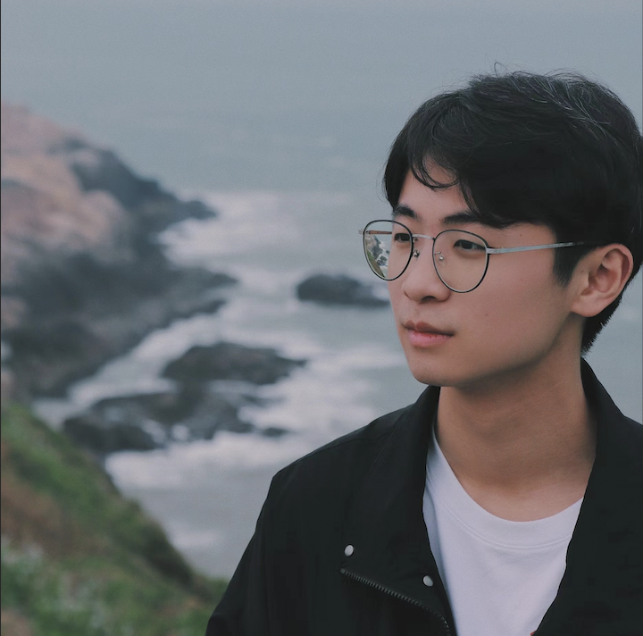

## About Me

I am a student of Master at College of Engineering, [Peking University](https://www.pku.edu.cn/), and under the supervision by professor [Lin Luo](https://www.coe.pku.edu.cn/teaching/all_time/11195.html). I've received the B.E. degree from [Zhejiang University of technology](http://www.zjut.edu.cn/) in 2021. I'm familiar with C/C++, Python and Pytorch, Tensorflow.

<!-- This is a jekyll based resume template. You can find the full source code on [GitHub](https://github.com/bk2dcradle/researcher) -->

## Research Interest

My research interest include Objective Detection, Image caption, and Deep Learning.

## Experience
* Intership in nstitute of information technology, Peking University. April 2021 -- June 2021

## Publications

to be updated

## Skills

* Programming Level: Familiar with C, C++ and Python ect. programming language and Pytorch and Tensorflow etc. deep learning frame work. And with some knowledge of SQL, HTML etc.
* Research Field: I'm interested in Objective Detection, Image caption, and has some knowledge of Question-Answer Generation and multi-module.
* English: TOEFL(100) 

<!-- ## Typography

This is a [link](http://google.com). Something *italics* and something **bold**.

Here is a table

Year | Award | Category
-----|-------|--------
2014 | Emmy  | Won Outstanding Lead Actor in a miniseries or a movie
2015 | BAFTA | Nominated for Best Leading Actor for Sherlock
2014 | Satellite | Won Best Actor miniseries or television film

Here is a horizontal rule

---

Here is a blockquote

> To a great mind, nothing is little -->

<!-- ## References -->
<!-- ## Reference

* Foo Bar: Head of Department, Placeholder Names, Lorem
* John Doe: Associate Professor, Department of Computer Science, Ipsum -->

## Awards
* Outstanding student, ZJUT, 2017-2020
* Top-10 students from Undergraduate to phd, Zhejiang Province, 2020
* National Scholarship, 2018-2021
* 2 Silver Medals, Kaggle, 2022
